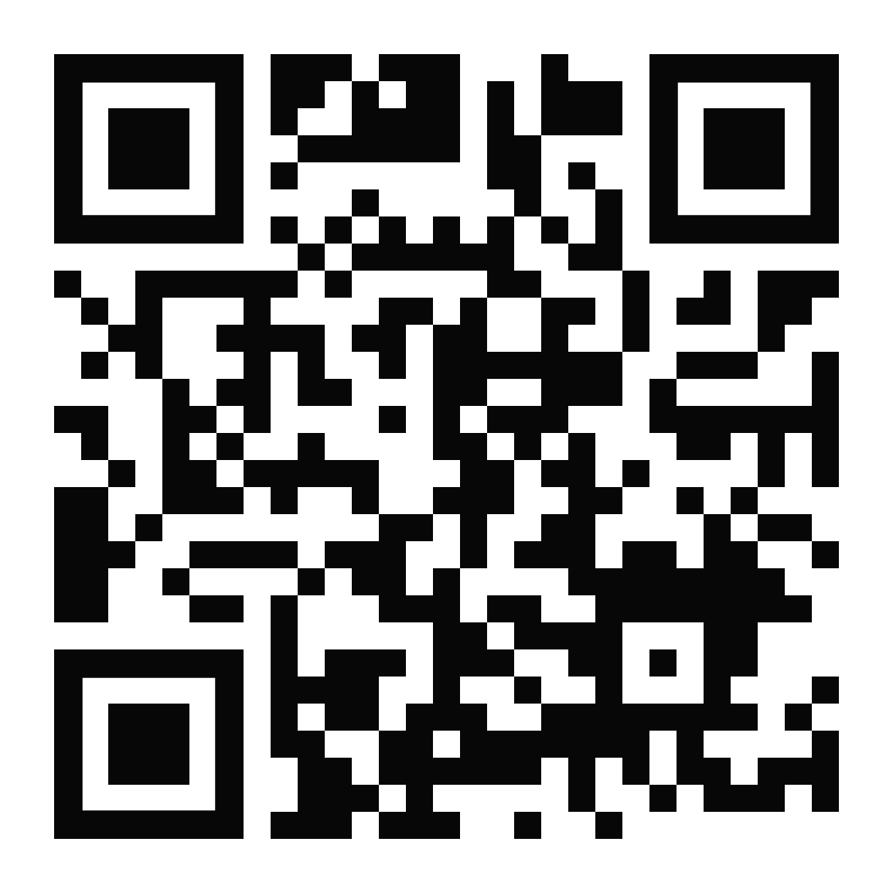

# Portafolio personal 🦦

Este repositorio forma parte de mi portafolio en línea. Aquí comparto un resumen de quién soy, algunos de los proyectos que he desarrollado y las áreas que más me interesan en el mundo del desarrollo de software.

---

## Contenido

- [Información personal](#información-personal)
- [Proyectos](#proyectos)
- [Áreas de interés](#áreas-de-interés)
- [Sitio web](#sitio-web)

---

## 🧾 Información personal

- **Nombre:** Luis Ernesto Roca Macias
- **Ocupación:** Estudiante de ESPOL
- **Lugar de residencia:** Guayaquil, Ecuador

---

## 🎯 Proyectos

### 🧩 PATTERNS
Implementación de patrones de diseño como Abstract Factory, Decorator, Adapter y Builder para crear reportes dinámicos, aplicar estilos, integrar servicios externos y construir objetos complejos de forma flexible.

- **Tecnologías:** Principios SOLID, Patrones de diseño, Java
- 🔗 [Repositorio del proyecto](https://github.com/LuisRoca09/TALLER04-PATTERNS)

### 🧩 Clinica Dental BD
Aplicación de escritorio para la administración completa de una clínica dental. Incluye funcionalidades CRUD para pacientes, dentistas, asistentes, citas, tratamientos e historias clínicas, además de consultas personalizadas y estadísticas clínicas.

- **Tecnologías:** Python, Tkinter, pymysql, MySQL, PIL
- 🔗 [Repositorio del proyecto](https://github.com/SKEIILAT/proyectoBD.git)

### 🧩 Agencia de vuelos (JAVA)
Aplicación de escritorio completa para reservar vuelos que cuenta con una interfaz que es facil de entender para el cliente, donde puede reservar su vuelo, elegir la hora y gestionar los pagos de los boletos.

- **Tecnologías:** JAVA, JAVAFX
- 🔗 [Repositorio del proyecto](https://github.com/ArianVillavicencio/PAR4_PROY2P_ROCA_VERGARA_VILLAVICENCIO.git)

---

## 🖥️ Tecnologias

Durante el curso, desarrollé habilidades en diversas tecnologías, frameworks y patrones de diseño, aplicándolos en proyectos prácticos que abarcan distintos ámbitos y lenguajes de programación.

1. **PATTERNS**  
   En este proyecto implementé patrones de diseño como Abstract Factory, Decorator, Adapter y Builder para crear reportes dinámicos, aplicar estilos, integrar servicios externos y construir objetos complejos de forma flexible. Para lograrlo, apliqué los principios SOLID que facilitan la creación de código modular y mantenible, todo desarrollado en **Java**. Este proyecto fortaleció mi comprensión sobre cómo estructurar sistemas robustos y escalables mediante patrones de diseño.

2. **Clínica Dental BD**  
   Este es un sistema de aplicación de escritorio para la gestión completa de una clínica dental, con funcionalidades CRUD para pacientes, dentistas, asistentes, citas, tratamientos e historias clínicas. Para su desarrollo utilicé **Python** junto con la librería **Tkinter** para la interfaz gráfica, y **pymysql** como conector para interactuar con la base de datos **MySQL**. Además, incorporé la librería **PIL** para el manejo de imágenes. Este proyecto me permitió aplicar conocimientos en bases de datos, programación orientada a objetos y creación de interfaces de usuario intuitivas.

3. **Agencia de vuelos**  
   En este proyecto desarrollé una aplicación de escritorio con **Java** y **JavaFX**, orientada a facilitar la reserva de vuelos. La aplicación cuenta con una interfaz amigable para el usuario donde se puede seleccionar horarios, gestionar reservas y pagos. La experiencia me permitió profundizar en el desarrollo de interfaces gráficas avanzadas y la interacción con el usuario final, además de integrar lógica para la gestión de reservas en tiempo real.

En conjunto, estos proyectos me ayudaron a consolidar competencias en programación, diseño de software, manejo de bases de datos y desarrollo de interfaces, utilizando tecnologías modernas y aplicando buenas prácticas de ingeniería de software.

---

## 🌐 Sitio web

https://luisroca09.github.io/LuisRoca09/

---
